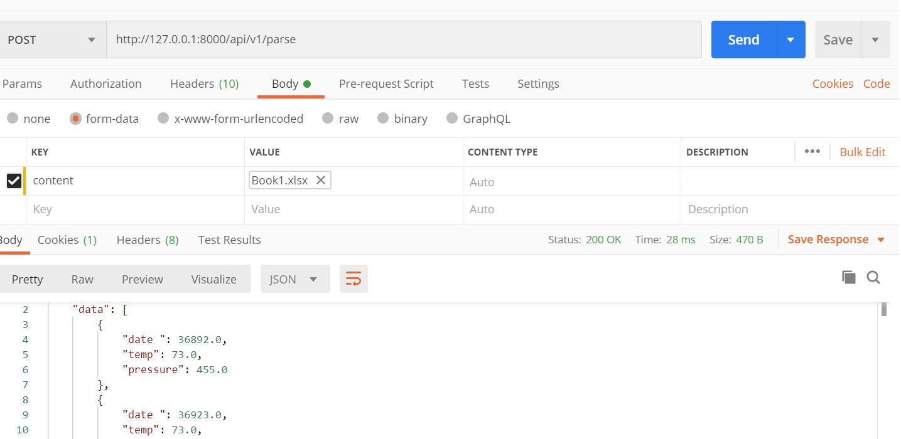
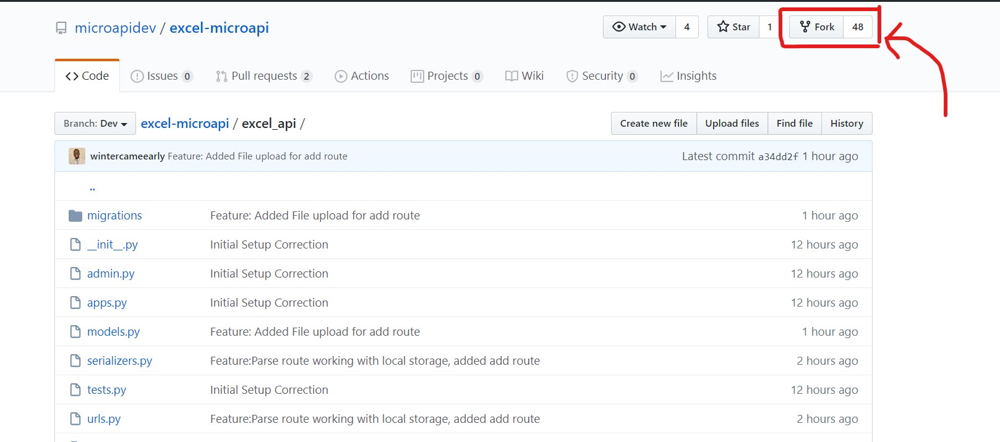

# Excel MicroAPI

This is a Microservice for managing Excel files
<br/>

It runs on the Django Framework, supported by Django Rest Framework

# Setting Up / Installation


## Step 1:
### Clone the project
```bash
git clone https://github.com/microapidev/excel-microapi
cd excel-microapi
```

## Step 2:
### Create and activate a Python Virtual Environment (this command only runs on py3)

```python
python -m venv venv
```
#### To activate the environment for Windows:

```python
.\venv\Scripts\activate
```

#### To activate the environment for Mac/Linux:

```python
source venv/bin/activate
```

## Step 3:
### Install the Libraries needed

```python
pip install -r requirements.txt
```
## Step 4:
### Start Server:
```python
python manage.py migrate
python manage.py runserver
```

## Step 5:
### Test with Postman:
Make a Post request with Postman. You can download it [here](https://www.postman.com/downloads/)
    
    
# Testing the endpoints.

# For the parse feature(display runtime to webpage, display success or error message to webpage) implemented by @adah:
### Endpoint: api/v1/parse/
### Method: POST
### Key: content
### Value: Excel file upload 
### Returns: Json with Parsed values and process_time to Parse Excel file.
https://app.clubhouse.io/startng/story/44854/display-success-error-message-to-webpage
https://app.clubhouse.io/startng/story/44837/display-runtime-it-took-to-get-your-results-on-webpage
https://app.clubhouse.io/startng/story/44809/create-excel-scripts-parser-that-returns-json-output
        
        
        
## For the get duplicates feature implemented by @p_yn3:
### Method: POST
### Endpoint: api/v1/duplicates/
### Key: content
### Value: From the uploaded excel file.
### Return: Returns duplicate values, drops all but 11 instance of each.
https://app.clubhouse.io/startng/story/44826/user-should-be-able-to-display-and-edit-replace-delete-duplicate-data
    
## For the print duplicates feature implemented by @p_yn3:
### Method: POST
### Endpoint: api/v1/printduplicates/
### Key: "content"
### Value: Output of the get duplicates feature
### Return: Prints duplicates to new column in excel sheet.
https://app.clubhouse.io/startng/story/53934/return-1-instance-of-each-duplicate-and-write-them-to-a-new-column

## Implement the Crud create feature implemented y @p_yn3:
https://app.clubhouse.io/startng/story/43196/crud-create-feature
    
## For the search feature implemented by @oluwanifemibam:
### Method: POST
### Endpoint : api/v1/search
### json data:
    {"column":The cloumn in which to search e.g A
    "content":File Upload
### Keyword:The keyword which you want to search for in that column}
### Returns: {"status":True or False}
https://app.clubhouse.io/startng/story/49279/have-a-search-filename-route-which-will-search-for-a-keyword-in-a-particular-file-and-return-the-amount-of-occurrences-of

## For the getall feature implemented by @oluwanifemibam:
### Endpoint : api/v1/getall
### Method: GET
### Return: all the files stored, the titles with which they were stored , and the location they were stored at.
https://app.clubhouse.io/startng/story/49267/have-a-getall-route-which-will-get-all-the-filenames-of-the-existing-uploaded-files

## For the add feature implemented by @oluwanifemibam:
### Endpoint : api/v1/add
### Method: POST
### json data:
{"title":The title(a name the user can remember) that the user wishes to use to store the file
# Content: File Upload
https://app.clubhouse.io/startng/story/53983/have-a-add-route-at-which-users-can-upload-an-excel-file-to-be-stored-in-our-media-server

## For the check for corrupt excel file feature implemented by @greg:
### Endpoint: api/v1/checkfile/     
### Method: POST
### Key: "content" 
### Value: File Upload
### Returns: Returns either unexpected error or file is clean.
https://app.clubhouse.io/startng/story/44831/user-should-be-able-to-check-for-corrupt-excel-file-and-display-error-messag

## For the return the integer sum of selected columns implemented by @greg:
### Endpoint: api/v1/column_sum/
### Method: POST
### Key: "content"
### Value: uploaded excel file 
### Key:column
### value: 1
### NB:column has to be the column number counting from one, from left to right.
https://app.clubhouse.io/startng/story/44888/return-the-sum-of-selected-column-in-excel-file-numbers-only

## For the add row feature implemented by @sajjad:
### Endpoint: api/v1/add_row/
### Method: POST
#### form-data
        KEY 1: "content ", VALUE1: excel file upload
        KEY 2: "data", VALUE2: {"sheet":<name of sheet>, "updated":<list of new row, in square brackets and seperated by comma>
        SAMPLE_REQUEST: {"sheet":"sheet1",
        "updated":["May-01",73,455]
}
https://app.clubhouse.io/startng/story/44819/user-should-be-able-to-modify-excel-data-write-back-to-excel-and-save-data-in-a-new-file


## Create a Docker container for the excel service @Austin-Deccentric:
https://app.clubhouse.io/startng/story/46935/docker-setup-create-the-docker-container-for-the-excel-parser-api

    


# Contributing
**If you are going to be making changes or adding features to this Project please do the following:**

 - ### Clone the Project
    Clone the project, if you have not done so, see [here](#step-1)

- ### Fork this repository
   **Create a Fork**. Here is how to:

    

  Keep track of the URL to the forked repository.
  It should usually be something like:

   **`https://github.com/<your_github_username>/excel-microapi`**

- ### Update the Push url for the local repo on your machine
-
  ```bash
  git remote origin set-url --push <insert forked url here>
  ```

    example:
  ```bash
  git remote origin set-url --push https://github.com/mark/excel-microapi
  ```


 - ### Create a new Branch with the feature name
      First pull the recent changes changes before creating a branch

     ```bash
      git pull
      git branch <feature_i_want_to_add>
     ```

     Work on your new changes and then push to your branch
    ```bash
    git push -u origin <feature_i_want_to_add>
    ```
 - ### Make a Pull Request on Github
